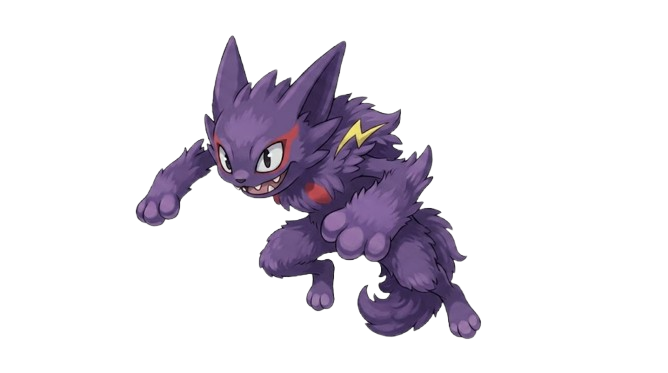
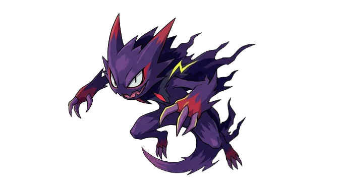
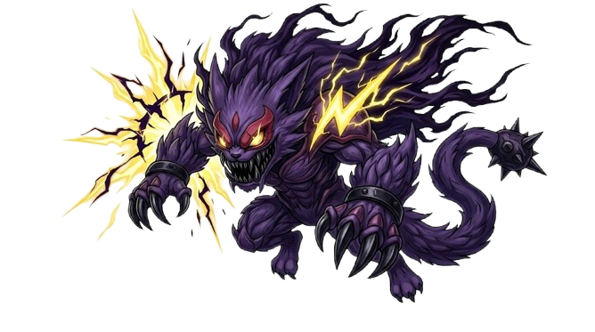

# 📖 Pokédex — Documentação do Projeto

Aplicação web desenvolvida com **Laravel 13** que permite listar, cadastrar, visualizar, editar e remover Pokémons em uma Pokédex personalizada. O projeto conta com Pokémons pré-carregados via seed e permite que o usuário crie os seus próprios.

---

## 📋 Índice

- [Requisitos](#-requisitos)
- [Instalação e Configuração do Ambiente](#-instalação-e-configuração-do-ambiente)
- [Estrutura de Pastas](#-estrutura-de-pastas)
- [Documentação da API / Rotas](#-documentação-da-api--rotas)
- [Pokémons Criados](#-pokémons-criados)
- [Ferramentas Utilizadas](#-ferramentas-utilizadas)

---

## ✅ Requisitos

- PHP >= 8.3
- Composer
- Node.js >= 18
- npm
- SQLite (padrão) ou outro banco configurado no `.env`

---

## 🚀 Instalação e Configuração do Ambiente

Siga os passos abaixo para deixar o projeto pronto para rodar localmente.

### 1. Instalar dependências PHP

```bash
composer update
```

Baixa e atualiza todos os pacotes PHP listados no `composer.json`.

### 2. Instalar dependências JavaScript

```bash
npm install
```

Instala os pacotes front-end definidos no `package.json`, incluindo Tailwind CSS, Alpine.js e Vite.

### 3. Configurar o arquivo de ambiente

O Laravel utiliza um arquivo .env para armazenar as configurações do ambiente local, como credenciais de banco de dados, chaves de API e outras variáveis sensíveis. O repositório inclui um .env.example com todos os campos necessários — basta copiá-lo para criar o seu próprio:

```bash
cp .env.example .env
```

Após copiar, abra o arquivo .env e ajuste as variáveis conforme o seu ambiente, especialmente as configurações de banco de dados (DB_*) e a URL da aplicação (APP_URL).

### 4. Gerar a chave da aplicação

```bash
php artisan key:generate
```

Gera uma chave de criptografia única para a aplicação e a salva no arquivo `.env`. Necessário para o funcionamento de sessões e cookies.

### 5. Executar as migrations

```bash
php artisan migrate
```

Cria as tabelas no banco de dados conforme definido nos arquivos de migration, incluindo a tabela `pokemons` e `sessions`.

### 6. Popular o banco com os dados iniciais

```bash
php artisan db:seed
```

Insere os três Pokémons padrão da Pokédex (Prudence, Caution e Scare) no banco de dados com suas imagens, tipos e status predefinidos.

### 7. Compilar os assets (opcional para desenvolvimento)

```bash
npm run dev
```

Inicia o servidor Vite para hot-reload em desenvolvimento. Para produção, use `npm run build`.

### 8. Iniciar o servidor

```bash
php artisan serve
```

Sobe a aplicação em `http://localhost:8000`.

---

## 📁 Estrutura de Pastas

```
projeto/
│
├── app/
│   ├── Http/
│   │   ├── Controllers/
│   │   │   ├── Controller.php              # Controller base
│   │   │   └── PokemonController.php       # Controller principal da Pokédex
│   │   └── Requests/
│   │       ├── Auth/
│   │       │   └── LoginRequest.php
│   │       └── ProfileUpdateRequest.php
│   ├── Models/
│   │   └── Pokemon.php                     # Model do Pokémon (casts para JSON)
│   ├── Providers/
│   │   └── AppServiceProvider.php
│   └── View/
│       └── Components/
│           ├── AppLayout.php
│           └── GuestLayout.php
│
├── bootstrap/
│   ├── app.php                             # Bootstrap da aplicação Laravel
│   └── providers.php
│
├── config/                                 # Arquivos de configuração (app, db, cache...)
│
├── database/
│   ├── migrations/
│   │   ├── 2026_05_05_165512_create_pokemon_table.php
│   │   └── 2026_05_05_180909_create_sessions_table.php
│   ├── seeders/
│   │   └── DatabaseSeeder.php              # Seed com os 3 Pokémons iniciais
│   └── database.sqlite                     # Banco de dados SQLite
│
├── lang/
│   └── pt_BR/                              # Tradução para português do Brasil
│
├── public/
│   ├── img/
│   │   ├── pokemons/                       # Imagens dos Pokémons criados pelo usuário
│   │   └── pokemons_fixos/                 # Imagens dos Pokémons do seed
│   └── index.php                           # Entry point da aplicação
│
├── resources/
│   ├── css/
│   │   └── app.css                         # Estilos globais (Tailwind)
│   ├── js/
│   │   └── app.js                          # Scripts globais (Alpine.js)
│   └── views/
│       ├── components/
│       │   ├── layouts/
│       │   │   ├── pokedex.blade.php       # Layout da tela da Pokédex
│       │   │   └── pokemon.blade.php       # Layout das telas de Pokémon
│       │   ├── button-library.blade.php    # Componente de botões
│       │   ├── library.blade.php           # Componente de biblioteca
│       │   └── types-pokemons.blade.php    # Componente de tipos
│       ├── pokemon/
│       │   ├── create.blade.php            # Tela de criação
│       │   ├── edit.blade.php              # Tela de edição
│       │   └── view.blade.php              # Tela de visualização
│       └── pokedex.blade.php               # Tela principal (listagem)
│
├── routes/
│   ├── console.php
│   └── web.php                             # Rotas da aplicação
│
├── storage/                                # Logs e arquivos gerados
│
├── .env                                    # Variáveis de ambiente
├── .env.example                            # Exemplo de variáveis de ambiente
├── artisan                                 # CLI do Laravel
├── composer.json                           # Dependências PHP
└── package.json                            # Dependências JavaScript
```

---

## 🌐 Documentação da API / Rotas

Todas as rotas estão definidas em `routes/web.php` e as lógicas de cada uma estão implementadas em `app/Http/Controllers/PokemonController.php`.

---

### `GET /pokedex`

**Nome:** `pokedex`  
**Controller:** `PokemonController@index`

Lista todos os Pokémons da Pokédex, separados em dois grupos: os Pokémons pré-carregados via seed (`seeded = true`) e os criados pelo usuário (`seeded = false`). Retorna a view `pokedex`.

---

### `GET /pokedex/pokemon/create`

**Nome:** `pokemon.create`  
**Controller:** `PokemonController@create`

Exibe o formulário para criação de um novo Pokémon. Retorna a view `pokemon.create`.

---

### `POST /pokedex/pokemon/store`

**Nome:** `pokemon.store`  
**Controller:** `PokemonController@store`

Processa o formulário de criação e salva um novo Pokémon no banco de dados. Realiza validação dos campos e faz o upload da imagem para `public/img/pokemons/`.

**Campos validados:**

| Campo    | Tipo         | Regras                                         |
|----------|--------------|------------------------------------------------|
| `name`   | string       | Obrigatório, máx. 255 caracteres, único na tabela |
| `image`  | arquivo      | Obrigatório, deve ser imagem (jpeg, png, jpg, gif) |
| `status` | array        | Obrigatório (hp, attack, defense, etc.)        |
| `types`  | array        | Obrigatório, mínimo 1, máximo 2 tipos          |

Após salvar, redireciona para `/pokedex` com mensagem de sucesso.

---

### `GET /pokedex/{id}/view`

**Nome:** `pokemon.view`  
**Controller:** `PokemonController@view`

Exibe os detalhes de um Pokémon específico buscado pelo `id`. Retorna a view `pokemon.view` com os dados do Pokémon. Retorna 404 automaticamente caso o `id` não exista.

---

### `GET /pokedex/{id}/edit`

**Nome:** `pokemon.edit`  
**Controller:** `PokemonController@edit`

Exibe o formulário de edição de um Pokémon existente. Busca o Pokémon pelo `id` e retorna a view `pokemon.edit`. Retorna 404 caso o `id` não exista.

---

### `PUT /pokedex/{id}/update`

**Nome:** `pokemon.update`  
**Controller:** `PokemonController@update`

Processa o formulário de edição e atualiza os dados do Pokémon no banco. Caso uma nova imagem seja enviada, a imagem antiga é removida do servidor e substituída. O campo `seeded` é automaticamente redefinido como `false` após a edição.

**Campos validados:**

| Campo    | Tipo         | Regras                                              |
|----------|--------------|-----------------------------------------------------|
| `name`   | string       | Obrigatório, máx. 255 caracteres, único (exceto o próprio) |
| `image`  | arquivo      | Opcional, deve ser imagem (jpeg, png, jpg, gif), máx. 2MB |
| `status` | array        | Obrigatório                                         |
| `types`  | array        | Obrigatório, mínimo 1, máximo 2 tipos               |

Após atualizar, redireciona para `/pokedex` com mensagem de sucesso.

---

### `DELETE /pokedex/{id}/delete`

**Nome:** `pokemon.destroy`  
**Controller:** `PokemonController@destroy`

Remove um Pokémon do banco de dados pelo `id`. Caso exista uma imagem associada ao Pokémon, ela também é deletada do servidor. Redireciona para `/pokedex` com mensagem de sucesso após a remoção.

---

## 🎮 Pokémons Criados

Os três Pokémons a seguir foram criados exclusivamente para este projeto e são inseridos automaticamente no banco via seed.

---

### Prudence



Prudence é um Pokémon pequeno e frágil do tipo **Psychic** e **Ghost**. Representa a primeira fase do medo: a prudência. Seu corpo é delicado, quase etéreo, com olhos grandes e atentos que nunca piscam. Ele é extremamente cauteloso, sempre se escondendo ou fugindo antes mesmo do perigo aparecer.
Apesar de ser fisicamente fraco, sua habilidade especial “Pressentimento” permite que ele preveja ataques com antecedência, tornando-o difícil de acertar. No lore, Prudence é visto como um espírito protetor que ensina os jovens a terem cuidado com o mundo perigoso. Evolui para Caution quando o treinador o expõe a situações de alto risco, forçando-o a transformar o medo em algo mais afiado.

| Status           | Valor |
|------------------|-------|
| HP               | 35    |
| Velocidade       | 60    |
| Ataque           | 20    |
| Defesa           | 45    |
| Ataque Especial  | 65    |
| Defesa Especial  | 80    |

---

### Caution



Caution é a forma intermediária, do tipo  **Ghost** e **Dark**. Aqui o medo já não é mais apenas fuga ele se torna atenção mortal. Seu corpo é mais alongado e ágil, com garras afiadas e um manto de sombras que distorce a percepção de quem olha para ele.
É significativamente mais forte que Prudence, com movimentos rápidos e precisos. Sua habilidade “Medo Calculado” aumenta seu poder conforme o oponente demonstra força, transformando o pavor alheio em combustível. Caution é conhecido por paralisar inimigos com um simples olhar, fazendo-os hesitarem no momento crítico. Ele representa o medo que torna o ser vivo mais perigoso e consciente.

| Status           | Valor |
|------------------|-------|
| HP               | 55    |
| Velocidade       | 90    |
| Ataque           | 45    |
| Defesa           | 55    |
| Ataque Especial  | 95    |
| Defesa Especial  | 85    |

---

### Scare



Scare é a evolução final, classificado como Pokémon Lendário (pseudo-lendário) do tipo  **Ghost** e **Dark**. Ele é literalmente chamado de “Deus do Medo” em algumas regiões antigas. Sua aparência é imponente e aterrorizante: uma figura alta e encapuzada, com olhos que brilham como abismos e uma presença que faz o ar ficar mais pesado.
Diz a lenda que quando Scare aparece, até Pokémon lendários sentem um calafrio. Sua habilidade “Terror Absoluto” pode induzir pânico incontrolável em qualquer criatura, independentemente do nível. Ele não precisa atacar fisicamente — o simples fato de sua existência já quebra a vontade dos oponentes.
Scare representa o medo em sua forma mais pura e divina: não só o instinto de sobrevivência, mas o pavor existencial que paralisa ou transforma tudo ao seu redor.

| Status           | Valor |
|------------------|-------|
| HP               | 90    |
| Velocidade       | 110   |
| Ataque           | 80    |
| Defesa           | 90    |
| Ataque Especial  | 135   |
| Defesa Especial  | 95    |


## A Linha do Medo

Três estágios. Uma essência. O medo que evolui junto com aquele que o carrega.

---

### 🌑 Prudence — *O Primeiro Medo*

> *"Aquele que hesita ainda tem algo a perder."*

Prudence é o medo em sua forma mais primitiva o instinto que sussurra para recuar antes mesmo do perigo aparecer. Frágil por fora, mas dotado de uma percepção que poucos compreendem. Não é fraqueza. É sabedoria nascendo.

---

### 🌒 Caution — *O Medo que Endurece*

> *"Entre fugir e lutar, há um instante. Caution vive nesse instante."*

Quando o medo encontra resistência, ele se transforma. Caution carrega as cicatrizes de quem já quis correr, mas ficou. Mais rápido, mais calculista, mais perigoso — não porque perdeu o medo, mas porque aprendeu a usá-lo como arma.

---

### 🌕 Scare — *O Medo Absoluto*

> *"Você não luta contra Scare. Você se rende a ele."*

Na sua forma final, o medo não precisa mais se esconder. Scare é a manifestação plena do terror aquele que não paralisa pelo grito, mas pelo silêncio que vem antes dele. Olhar nos seus olhos é entender, de uma vez por todas, que alguns medos nunca passam. Eles apenas crescem.

---

*Do sussurro ao abismo — Prudence, Caution, Scare.*

## 🛠 Ferramentas Utilizadas

### Laravel 13
Framework PHP principal do projeto. Responsável pelo roteamento, controllers, models, migrations, seeders e sistema de views com Blade. Utiliza a versão mais recente do framework com suporte nativo ao PHP 8.3.

### PHP 8.3
Linguagem back-end do projeto. A versão 8.3 traz melhorias de performance e novos recursos de tipagem que são utilizados ao longo da aplicação.

### MySQL
Banco de dados relacional robusto utilizado nos ambientes de produção e homologação. Diferente do SQLite, o MySQL funciona como um servidor de banco de dados independente, oferecendo maior performance para múltiplas conexões simultâneas e recursos avançados de gerenciamento de dados. No Laravel, a configuração é centralizada no arquivo .env.

### Blade
Motor de templates nativo do Laravel. Utilizado para renderizar todas as views do projeto, incluindo a listagem da Pokédex, formulários de criação e edição, e tela de visualização de Pokémons.

### Tailwind CSS
Framework de CSS utilitário utilizado para estilização da interface. Integrado via Vite com o plugin `@tailwindcss/vite` e `@tailwindcss/forms` para estilização de formulários.

### Alpine.js
Framework JavaScript minimalista utilizado para interações de front-end reativas (como toggles, validações visuais e estados de interface) sem a necessidade de um framework pesado.

### Vite
Ferramenta de build e bundler de assets modernos. Responsável por compilar e servir os arquivos CSS e JavaScript do projeto, integrado ao Laravel via `laravel-vite-plugin`.

### Laravel Breeze
Pacote de autenticação do Laravel utilizado como base para scaffolding de autenticação (login, registro, sessão). Fornece a estrutura inicial de rotas e views de autenticação.

### Laravel Lang (pt_BR)
Pacote de tradução utilizado para internacionalizar a aplicação para o português do Brasil, cobrindo mensagens de validação, autenticação e paginação.

### Composer
Gerenciador de dependências PHP. Responsável por instalar e atualizar todos os pacotes back-end do projeto.

### npm
Gerenciador de pacotes JavaScript. Responsável por instalar as dependências de front-end listadas no `package.json`.